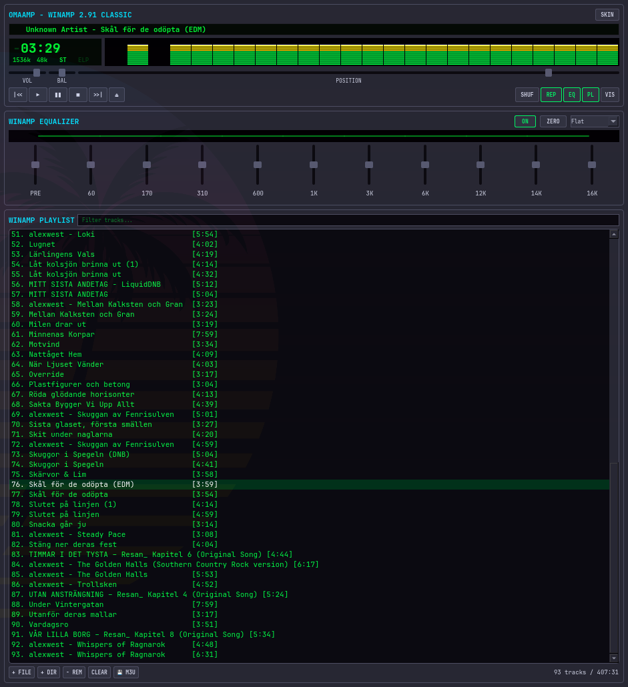

# OmaAmp ⚡🎵

A genuine, standalone **Winamp 2.91 Classic Audio Player** built with Python, Qt, and real-time DSP audio processing for Linux & Omarchy.

Featuring a tileable responsive layout, real-time FFT spectrum analyzer / PCM oscilloscope, demoscene visualizer modes, retro 7-segment green phosphor LED time display, marquee scrolling track screen, 10-band IIR biquad graphic equalizer with presets, drag-and-drop playlist editor, and a fully customizable theme engine!



---

## 🎛️ Key Features

* **📻 Authentic Winamp 2.91 Main Player:**
  * **7-Segment LED Clock:** Displays elapsed or remaining track time (`-03:45`) with ghost LCD back-lighting. Click the time digits to toggle mode!
  * **Real-time FFT Spectrum Visualizer:** 24-band Fast Fourier Transform (FFT) frequency analyzer with gravity peak-drop physics calculated directly from playing audio samples. Click or right-click to switch between 6 modes!
  * **Marquee LCD Screen:** Smooth scrolling song title and artist.
  * **Specs Readout:** Real-time bitrate (`320 kbps`), sample rate (`44.1 kHz`), and `STEREO` / `MONO` indicator lights.
  * **Controls:** `|<<` (Prev), `▶` (Play), `❚❚` (Pause), `■` (Stop), `>>|` (Next), `⏏` (Eject/Open).
  * **Sliders:** Master Volume (`VOL`), Left/Right Balance (`BAL`), and Track Seek Position (`POSITION`).
  * **Modes:** `SHUF` (Shuffle) and `REP` (Repeat).

* **🎚️ 10-Band Real-time DSP Graphic Equalizer (`EQ`):**
  * True digital signal processing using 10 second-order peaking IIR biquad filters (60Hz, 170Hz, 310Hz, 600Hz, 1kHz, 3kHz, 6kHz, 12kHz, 14kHz, 16kHz).
  * Preamp slider (±12 dB) with analog soft limiter.
  * Live frequency response curve graph.
  * One-click presets: *Rock, Pop, Techno, Dance, Full Bass, Full Treble, Club, Classical, Live, Flat*.
  * `ON` toggle for instant A/B sound comparison and `ZERO` button to reset all bands.

* **🌌 6 Demoscene Visualizer Modes & Visualizer Studio:**
  1. **📊 Spectrum Analyzer (Real FFT):** 24 discrete multi-color LED frequency bars.
  2. **〰️ Laser Oscilloscope (Real PCM):** Exact glowing laser waveform curve.
  3. **📻 Dual Analog VU Meters (Real RMS):** True bouncing L/R needles with dB meters.
  4. **✨ 3D Warp Starfield:** 3D space warp accelerating to bass kicks.
  5. **💻 Matrix Code Rain:** Cascading green digital rain reacting to tempo.
  6. **🔘 Polar Frequency Ring:** 360-degree radial bass visualizer.
  * Click **`VIS`** to open **Visualizer Studio** in a resizable window with Fullscreen mode!

* **📜 Drag & Drop Playlist Editor (`PL`):**
  * **Drag & Drop:** Simply drag MP3, FLAC, WAV, OGG, AAC files or folders straight from your file manager into OmaAmp!
  * Instant search filter to find tracks in massive libraries.
  * Automatic state save and restore on application restart (`~/.config/omaamp/playlist.json`).
  * `💾 M3U` button to export and import standard `.m3u` playlists.

* **🎨 Custom Themes & Skin Engine:**
  * Comes with 4 built-in themes:
    1. **Classic Retro Winamp:** Iconic gunmetal chassis with green LED phosphor.
    2. **Modern Obsidian & Cyan:** Sleek obsidian surfaces with high-contrast cyan glow.
    3. **Cyberpunk Neon 2077:** Hot pink, neon cyan, and deep purple.
    4. **Amber Phosphor CRT:** Vintage monochrome amber terminal feel.
  * **Built-in Theme Editor:** Click the **`SKIN`** button in the titlebar to switch themes in real-time or click **`🎨 Create / Edit Custom Theme`** to customize any color and save directly into `~/.config/omaamp/themes/`!

---

## 🚀 Installation & Launch

### 1-Click Install:
Clone and run the installer:
```bash
git clone https://github.com/alexwest1981/OmaAmp.git
cd OmaAmp
./install.sh
```

### Launching:
* **Via Terminal:** `omaamp` (or `omaamp ~/Music/*.mp3`)
* **Via App Menu:** Press `Super + Space` (or your app launcher) and search for **OmaAmp**!

---

## 🎨 How to Create Custom Themes

OmaAmp stores user themes in `~/.config/omaamp/themes/`.

To create a new theme manually, create a JSON file (e.g. `~/.config/omaamp/themes/my_theme.json`):

```json
{
  "id": "my_theme",
  "name": "My Custom Theme",
  "author": "Your Name",
  "description": "Custom color palette for OmaAmp",
  "colors": {
    "chassis_bg": "#1e1e24",
    "chassis_border": "#3c3c4a",
    "panel_bg": "#000000",
    "titlebar_bg": "#141418",
    "titlebar_text": "#00e5ff",
    "lcd_bg": "#020902",
    "lcd_text": "#00ff66",
    "lcd_text_dim": "#003b0c",
    "lcd_kbps": "#00dd22",
    "vis_bg": "#000000",
    "vis_bars_low": "#00ff44",
    "vis_bars_mid": "#ffea00",
    "vis_bars_high": "#ff2200",
    "vis_peaks": "#ffffff",
    "vis_oscilloscope": "#00ff66",
    "button_bg": "#2a2a34",
    "button_border": "#444456",
    "button_text": "#d4d8e8",
    "button_active": "#00ff66",
    "slider_trough": "#0a0a0e",
    "slider_thumb": "#5a5d72",
    "playlist_bg": "#0a0a0f",
    "playlist_text": "#00ff44",
    "playlist_selected_bg": "#003318",
    "playlist_selected_text": "#ffffff",
    "playlist_playing_text": "#ffcc00",
    "playlist_playing_bg": "#222000"
  }
}
```
Open OmaAmp, click **`SKIN`**, and your theme will appear immediately in the list!

---

## 📄 License

MIT License © 2026 [Alex Weström](https://github.com/alexwest1981)
